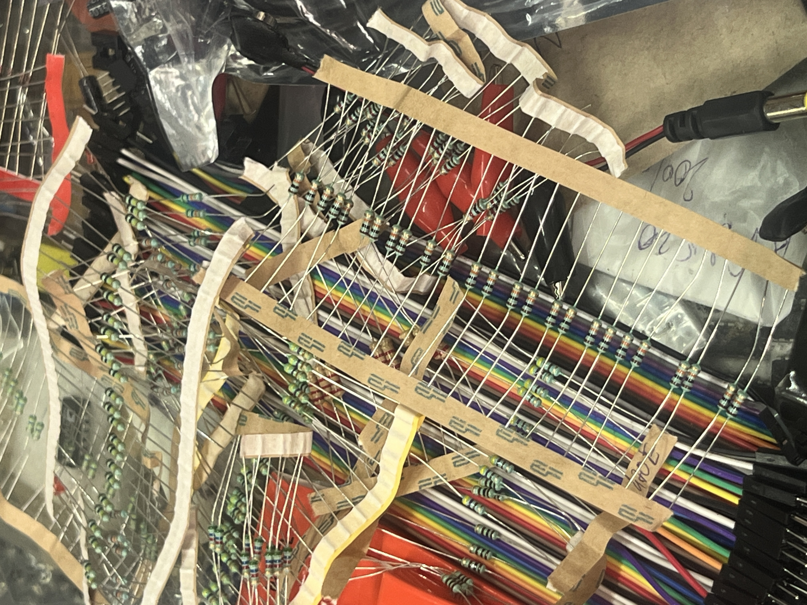
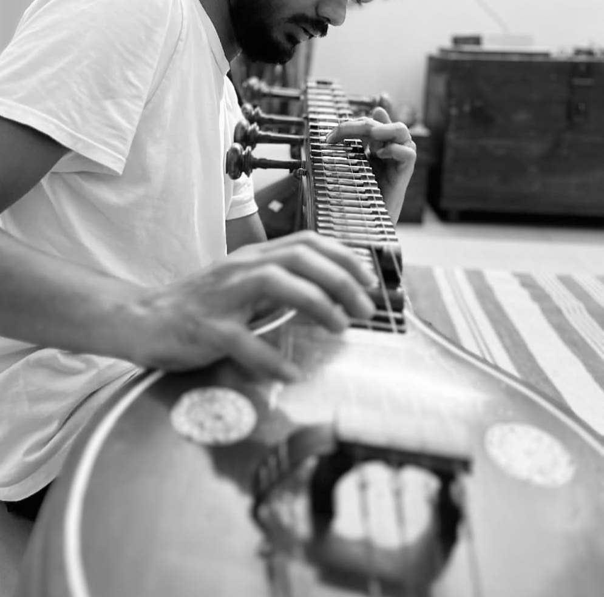
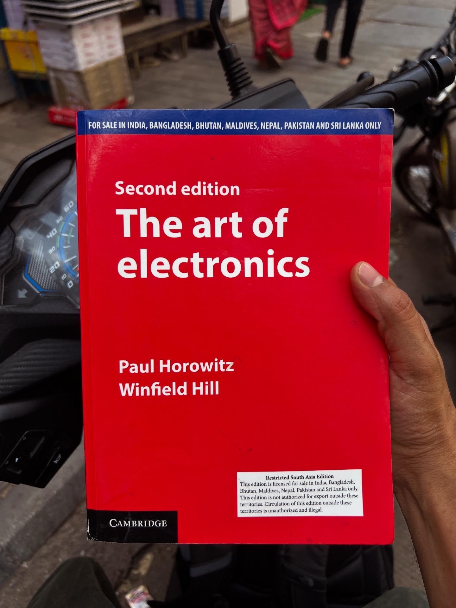

# My Electronics Home Lab

Documenting my journey into practical electronics, component testing, and circuit design with the ultimate goal of designing audio and instrument effects gear. Expect thorough project logs, schematic deep-dives, and honest documentation of my engineering failures and how I fixed them.

  

For a task to be completed, one needs three things. 

- The Desire to do the task
- The Knowledge to do the task
- The Strength to do the task

And these three are all needed, and equally important without any imposition of heirarchy to complete any task.

In my journey - What is my desire with respect to setting up an electronics lab? What is my end goal? 
In short - to be able to design really cool instrument effects - especially reverb pedals. 

My journey began with renting a guitar pedal (the good ones are so darn expensive to purchase, shoutout to [Noiseboyz](https://noiseboyz.com/) who let you rent expensive gear for an affordable subscription) - the Walrus Slo, I was absolutely mindblown on how a piece of gear could achieve suche depth of sound, not created from elsewhere but derived from what I actually fed into it.
And to realize that everything behind the pedal was actually electronics, the manupulation of voltages and frequencies. The urgent need to be able to understand how it functions and design my own was immense. 

I grew up around electronics and lab equipment. My dad, my uncles were all OG electronics and electricals nerds and designers from Bangalore, India. 
Some of my earliest memories with electronics were my uncle asking me to do continuity tests because he was babysitting me and he needed to keep me engaged. Lol! 
Also being a classically trained musician, I knew that there aren't a lot of dedicated effects pedals for Indian accoustic instruments. Unsure if it is because it isn't used or it doesn't exist - but nonetheless, didn't stop me from desiring to design some effects for instruments like the [veena](https://www.extrica.com/article/23505#:~:text=citation%20was%20made.-,Abstract,planes%20at%20different%20radial%20distances%20from%20the%20assumed%20center%20is%20discussed.,-Highlights) or the sitar which has absolutely magical frequency range and invokes a feeling of sitting in a palace. So, the desire existed - I needed to "know" how to design.

<figure align="center">
  
  <figcaption>Me playing my mother's 50-year-old veena.</figcaption>
</figure>

 
Now comes the Knowledge part - Well, I never knew I would actually bring the Engineering degree I hold out to the moonlight because I wasn't able to enjoy my journey entirely. 
 
Not because of the subject but because of the syllabus. I found my syllabus to be extremely dry and theory based and the lack of exposure to real life applications left me wondering "why do I even need to know the working function of a bi-polar junction transistor? simply to write an exam and pass?". The education system in the 2010's still didn't encourage the students to approach with curiosity and application thinking in mind. 
 
But I did have an understanding of the foundation principles of passive, power and digital electronics, thanks to my engineering. I just lacked any sort of application driven understanding to design anything. Because it had been many moons since I thought like an electronics engineer, I desperately wanted to exercise that muscle and have some sort of refresher on the core concepts. That's when I hopped on my trusted scooter and went in search of sources of knowledge that will jog my memory. 

  

 
Last but not least, we come to the strength part of this task. Which involves action - To actuallyexercise my knowledge towards achieving my desire of designing sound effects. 

Which means : 

- I am grateful to my eyes, ears, hands and feet to enable me to be able to do the things physically
- I am grateful to my intellect that is able to understand and comprehend everything that helps me make sense of things
- I am extremely grateful to the resources like money, food and time
- Most importantly, to my family and friends who stand by my as manifested gods, supporting me in my every endevour.  
